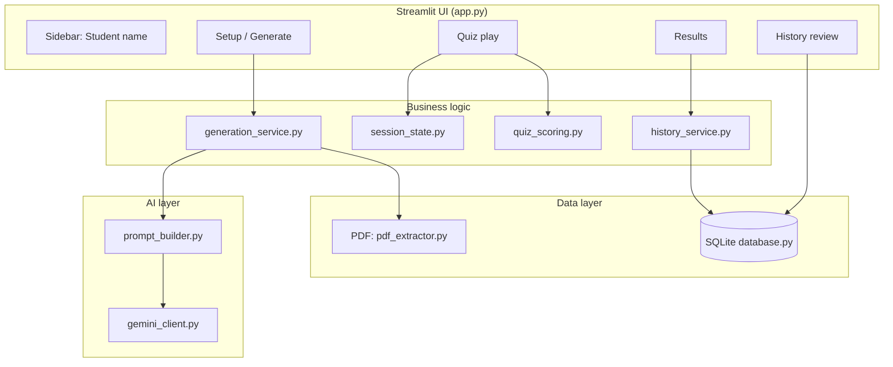
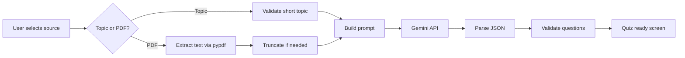
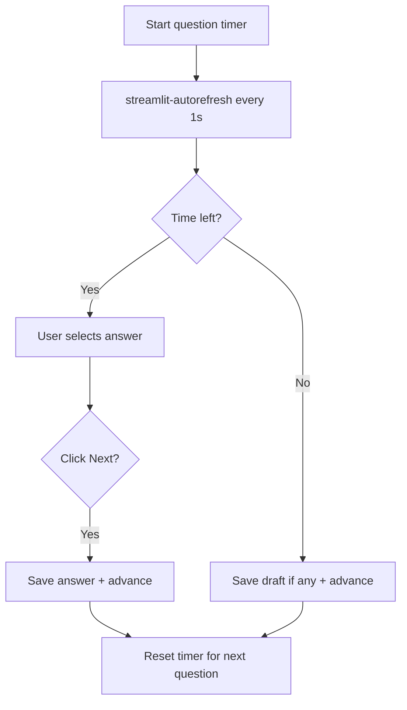
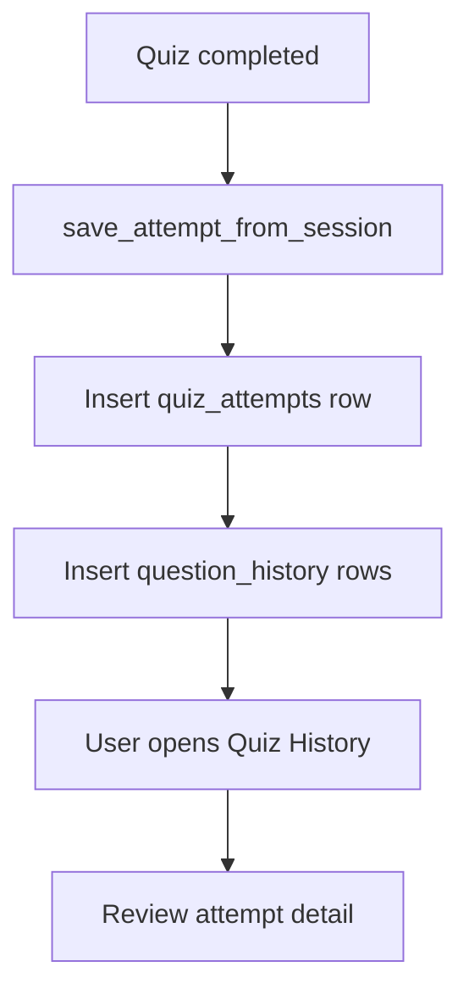
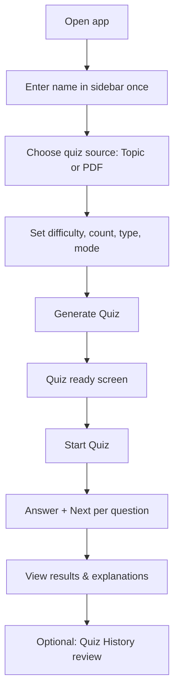

# AI Quiz Generator — EdTech Quiz Platform

An AI-powered quiz platform that helps students practice and revise topics through dynamically generated assessments. Built with **Python**, **Streamlit**, **Google Gemini API**, and **SQLite**.

---

## Table of Contents

1. [Overview](#overview)
2. [Features](#features)
3. [Tech Stack](#tech-stack)
4. [Architecture](#architecture)
5. [Project Structure](#project-structure)
6. [Prompt Engineering](#prompt-engineering)
7. [User Workflow](#user-workflow)
8. [Timer System](#timer-system)
9. [Database & History](#database--history)
10. [Challenges & Solutions](#challenges--solutions)
11. [Future Improvements](#future-improvements)
12. [Installation & Setup](#installation--setup)
13. [How to Run](#how-to-run)
14. [License](#license)

---

## Overview

### What is this project?

**AI Quiz Generator** is a web-based EdTech application where students can:

- Enter a **topic** (e.g. Python, DBMS, Machine Learning) or upload a **PDF**
- Generate quizzes instantly using **Google Gemini**
- Attempt quizzes in **timed** or **no-timer** mode
- Review scores, explanations, and **past attempts** stored in SQLite

### Objective

Reduce the effort of creating practice questions manually and give students a self-paced revision tool with immediate feedback and history tracking.

### Real-world use case

| Scenario | How the platform helps |
|----------|-------------------------|
| Self-study | Student enters “Operating Systems” and gets 10 MCQs in seconds |
| Exam prep | Upload lecture PDFs; questions are generated from document content only |
| Classroom / internship demos | Timed mode simulates exam conditions; history tracks progress over time |

---

## Features

### AI quiz generation
- Questions generated via **Google Gemini** (`gemini-2.5-flash` with fallbacks)
- JSON-validated output (MCQ, True/False, One Word, Mixed)

### Quiz sources
| Source | Description |
|--------|-------------|
| **Topic / Subject** | Short keyword input (e.g. `Java Loops`, `Computer Networks`) |
| **PDF Upload** | Text extracted with `pypdf`; questions limited to PDF content |

### Quiz types
- **MCQ** — 4 options, correct index, explanation  
- **True/False** — Boolean answers with explanations  
- **One Word** — Single-word answers (case-insensitive scoring)  
- **Mixed** — Random combination of all three types  

### Quiz modes
| Mode | Behavior |
|------|----------|
| **Timed Quiz** | Countdown per question; auto-advance on timeout; manual **Next Question** |
| **No Timer Quiz** | Unlimited time; advance only via **Next Question** |

### Learning & review
- Score and accuracy percentage  
- Per-question explanations  
- **Quiz history** in SQLite (full attempt + every question)  
- **Attempt review** with correct/wrong highlighting  

### Platform UX
- **Student name** — enter once in sidebar; persists for history  
- **Session persistence** — quiz state survives Streamlit reruns  
- **Progress indicator** — Question X of Y  
- Modular codebase for maintainability  

---

## Tech Stack

| Layer | Technology |
|-------|------------|
| **Frontend / UI** | Streamlit |
| **Backend logic** | Python 3.10+ |
| **AI model** | Google Gemini API (`google-generativeai`) |
| **Database** | SQLite (`quiz_history.db`) |
| **PDF parsing** | pypdf |
| **Timer refresh** | streamlit-autorefresh |
| **Config** | python-dotenv |

### Key libraries (`requirements.txt`)

```
streamlit>=1.37.0
google-generativeai>=0.8.0
python-dotenv>=1.0.0
streamlit-autorefresh>=1.0.1
pypdf>=4.0.0
```

---

## Architecture

### High-level system flow



### Quiz generation workflow



### Timer workflow (timed mode only)



### History storage workflow



### Backend flow (simplified)

1. **`app.py`** — Page routing (`setup` → `loading` → `ready` → `playing` → `results` / `history`)  
2. **`generation_service.py`** — Prepares content, calls `quiz_generation.py`  
3. **`gemini_client.py`** — API call with model fallback  
4. **`session_state.py`** — Quiz progress, timer, answers, student name  
5. **`quiz_ui.py`** — Renders timed or untimed quiz screens  
6. **`history_service.py` + `database.py`** — Persist and retrieve attempts  

---

## Project Structure

```
AI_Quiz_Generator/
├── app.py                 # Main Streamlit entry point & page routing
├── config.py              # Constants (quiz types, modes, timers, DB path)
├── session_state.py       # Session init, timer, navigation, student name
├── gemini_client.py       # Gemini API key, errors, JSON extraction helpers
├── prompt_builder.py      # Dynamic prompts (topic vs PDF, quiz type)
├── content_utils.py       # Topic/PDF validation & truncation
├── pdf_extractor.py       # PDF → plain text (pypdf)
├── generation_service.py  # Orchestrates extract → prompt → generate
├── quiz_generation.py     # Calls AI, validates question JSON
├── quiz_scoring.py        # Scoring, answer formatting
├── quiz_ui.py             # Timed/untimed quiz UI, results summary
├── review_ui.py           # History list & attempt review UI
├── history_service.py     # Save/load attempts (business logic)
├── database.py            # SQLite schema & CRUD
├── requirements.txt       # Python dependencies
├── .env.example           # API key template
├── quiz_history.db        # SQLite DB (created at runtime)
└── README.md
```

### Module responsibilities

| File | Purpose |
|------|---------|
| **`app.py`** | UI screens: setup, loading, quiz ready, play, results, history; wires all modules |
| **`config.py`** | Single source of truth for enums, timer options, model list, `DB_PATH` |
| **`session_state.py`** | `init_session`, page resolver, timer sync, answer commit, student name read-only helpers |
| **`gemini_client.py`** | Configure API, friendly errors, `generate_content()`, JSON cleanup |
| **`prompt_builder.py`** | `build_topic_prompt()` vs `build_pdf_prompt()` by source & quiz type |
| **`content_utils.py`** | Min validation for PDF text; short topic validation (no 50-char rule) |
| **`pdf_extractor.py`** | Read PDF bytes → concatenated page text |
| **`generation_service.py`** | `prepare_content_from_request()` + `run_quiz_generation()` |
| **`quiz_generation.py`** | Build prompt, parse response, `validate_question()` per type |
| **`quiz_scoring.py`** | `is_correct()`, `calculate_score()`, display formatters |
| **`quiz_ui.py`** | `render_timed_quiz_screen()` / `render_untimed_quiz_screen()`, results UI |
| **`review_ui.py`** | History list, expandable question cards for past attempts |
| **`history_service.py`** | `save_attempt_from_session()`, fetch summaries/details |
| **`database.py`** | Tables `quiz_attempts`, `question_history`, indexes for analytics |

### How modules interact

```
app.py
  ├── session_state (state + navigation)
  ├── generation_service → quiz_generation → prompt_builder + gemini_client
  ├── quiz_ui → quiz_scoring + session_state
  ├── history_service → database
  └── review_ui → history_service
```

---

## Prompt Engineering

### Why it matters

Gemini returns natural language by default. The app forces **structured JSON** with strict schemas per quiz type so the UI can render options, score answers, and show explanations reliably.

### Dynamic prompt factors

| Factor | Effect on prompt |
|--------|------------------|
| **Quiz source** | Topic mode: AI uses subject knowledge; PDF mode: “only from document text” |
| **Quiz type** | Different JSON schemas (MCQ / T-F / one-word / mixed) |
| **Difficulty** | Injected as Easy / Medium / Hard |
| **Question count** | Exact number requested in prompt |

### Topic-based example (conceptual)

```
Generate a Medium difficulty MCQ quiz on the topic: "Python Loops".
Use your knowledge of this subject...
Return ONLY a valid JSON array...
```

### PDF-based example (conceptual)

```
Generate a Medium difficulty MCQ quiz using ONLY the PDF content below.
--- PDF CONTENT START ---
[extracted text]
--- PDF CONTENT END ---
```

### Quality controls

- **JSON-only** instruction (no markdown wrappers when possible)  
- **`extract_json()`** strips code fences if the model adds them  
- **`validate_question()`** enforces 4 options, boolean T/F, single-word answers  
- **PDF truncation** at ~14,000 characters to avoid token limits  
- **Model fallback chain** in `config.GEMINI_MODELS` if one model is unavailable  

---

## User Workflow



### Step-by-step

1. **Enter name** — Sidebar `Student name` (stored for history; enter once).  
2. **Select quiz source** — Topic/Subject or PDF upload.  
3. **Configure quiz** — Difficulty, number of questions, quiz type, timed/no timer.  
4. **Generate Quiz** — AI creates questions; brief loading screen.  
5. **Start Quiz** — One question at a time with progress bar.  
6. **Attempt** — Select answer; click **Next Question** (timer auto-advances in timed mode).  
7. **Results** — Score, per-question review, explanations.  
8. **History** — Sidebar → **Quiz History** → open past attempts.  

---

## Timer System

### Architecture

| Component | Role |
|-----------|------|
| `timer_start` | Unix timestamp when current question began |
| `timer_question_idx` | Ensures timer resets only on question change |
| `streamlit-autorefresh` | 1-second reruns to update countdown UI |
| `process_question_timeout()` | Timed mode only; advances when time hits 0 |

### Manual next (both modes)

- User selects an answer (widget state in `session_state`).  
- **Next Question** saves to `answers` and calls `advance_to_next_question()`.  
- User can **change answer** before clicking Next (or before timeout in timed mode).  

### Auto-next (timed mode only)

- When `remaining_time == 0`, draft answer is saved if present, then advance.  
- No `st.rerun()` inside widget callbacks (Streamlit best practice).  

### Session & rerenders

- Widget keys (`mcq_0`, `tf_0`, etc.) hold draft selections.  
- `student_name` widget lives in sidebar on every run so the name persists.  
- `student_name_saved` backup key avoids losing name across generation reruns.  

---

## Database & History

### Schema (relational)

**`quiz_attempts`**

| Column | Description |
|--------|-------------|
| attempt_id | Primary key |
| student_name | Student |
| topic | Topic label or PDF name |
| quiz_type, quiz_mode, quiz_source, difficulty | Metadata |
| score, total_questions, accuracy | Results |
| date_time | UTC timestamp |

**`question_history`**

| Column | Description |
|--------|-------------|
| question_id | Primary key |
| attempt_id | Foreign key → `quiz_attempts` |
| question_index | Order in quiz |
| question, options_json | Content |
| user_answer, correct_answer, explanation | Review data |
| is_correct | 0 or 1 |

### Attempt review

- List attempts (filter by student name).  
- **Review** opens full attempt with expandable question cards (wrong answers expanded by default).  

### Future scalability

Indexes on `student_name`, `date_time`, and `attempt_id` support:

- Dashboards (accuracy over time)  
- Weak-topic detection (aggregate `is_correct` by topic)  
- Class-level reports (filter by name)  
- AI recommendations (train on history table)  

---

## Challenges & Solutions

| Challenge | Solution |
|-----------|----------|
| **Streamlit reruns** | Central `session_state`; page resolver; no manual writes to widget-owned keys |
| **Student name lost after Generate** | Sidebar widget always rendered first; `student_name_saved` backup key |
| **`st.session_state.student_name` exception** | Never assign after `text_input(key="student_name")`; read-only + backup key |
| **Timer not updating** | `streamlit-autorefresh` + timer UI in timed fragment; `timer_start` per question |
| **Double navigation on answer** | Removed auto-advance on select; only **Next** or timeout advances |
| **Generate Quiz needed two clicks** | `pending_generation` queue + `st.rerun()` after generation completes |
| **Gemini 404 / quota errors** | Model fallback list; `friendly_api_error()` messages |
| **Invalid AI JSON** | `extract_json()` + `validate_question()` with user-facing errors |
| **PDF image-only files** | Clear error when no extractable text |
| **History design** | Normalized SQLite schema; modular `database.py` / `history_service.py` |

---

## Future Improvements

- 📊 **Analytics dashboard** — accuracy trends, weak topics  
- 🏫 **Classroom mode** — teacher creates quiz, students join with code  
- 🏆 **Leaderboard** — compare scores per topic  
- 🎯 **Adaptive learning** — harder questions on weak areas  
- 🔐 **Authentication** — login instead of name-only tracking  
- ☁️ **Cloud deployment** — Streamlit Community Cloud / Docker  
- 🤖 **Recommendation engine** — suggest topics from history  
- 🌐 **Multi-language quizzes**  
- 📤 **Export results** — PDF/CSV report of attempts  

---

## Installation & Setup

### Prerequisites

- Python 3.10 or higher  
- Google Gemini API key ([Google AI Studio](https://aistudio.google.com/apikey))  

### 1. Clone or download the project

```bash
cd AI_Quiz_Generator
```

### 2. Create a virtual environment

**Windows (PowerShell):**

```powershell
python -m venv venv
.\venv\Scripts\activate
```

**macOS / Linux:**

```bash
python3 -m venv venv
source venv/bin/activate
```

### 3. Install dependencies

```bash
pip install -r requirements.txt
```

### 4. Configure environment variables

Copy the example file and add your API key:

```bash
copy .env.example .env
```

Edit `.env`:

```env
GEMINI_API_KEY=your_actual_api_key_here
```

Optional — force a specific model:

```env
GEMINI_MODEL=gemini-2.5-flash
```

> **Never commit `.env` to Git.** Add `.env` to `.gitignore`.

---

## How to Run

From the project root (with venv activated):

```bash
streamlit run app.py
```

The app opens in your browser (default: `http://localhost:8501`).

### Quick usage checklist

1. Enter your **name** in the sidebar.  
2. Choose **Topic / Subject** or **PDF Upload**.  
3. Click **Generate Quiz** → **Start Quiz**.  
4. Complete the quiz → view results → **Quiz History** to revise.  

---

## License

This project is intended for educational and portfolio use. Add your preferred license (e.g. MIT) before public distribution.

---

## Author

Built as an AI-powered EdTech quiz platform demonstrating full-stack integration of Streamlit, Gemini API, and SQLite with modular Python architecture.

**GitHub portfolio · Internship submission · Technical interviews**
